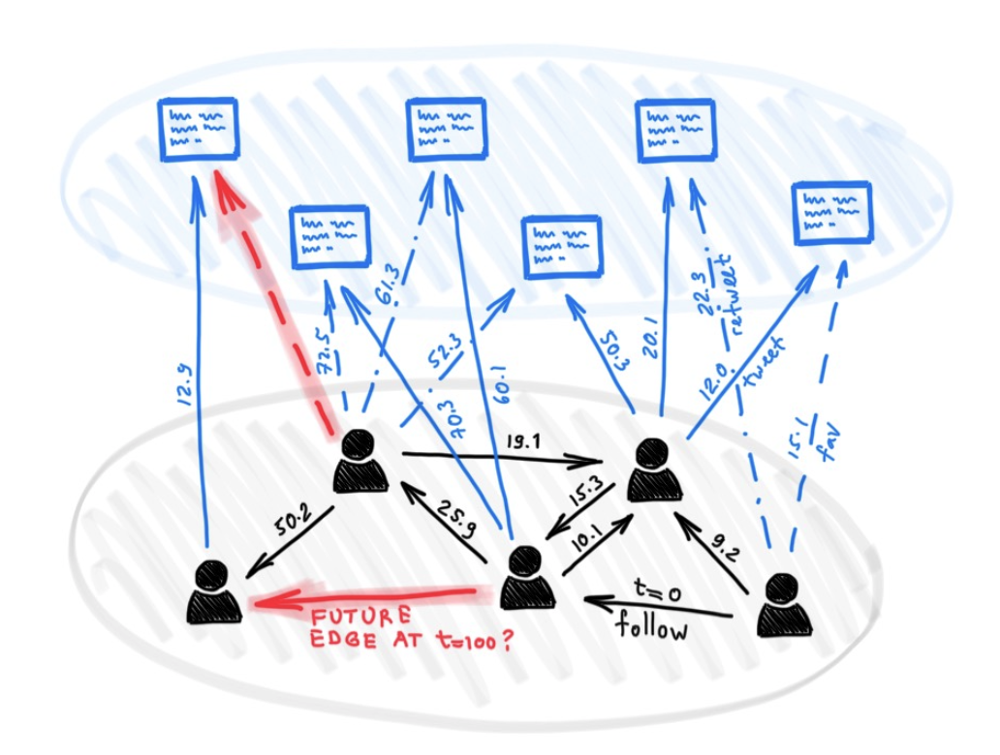
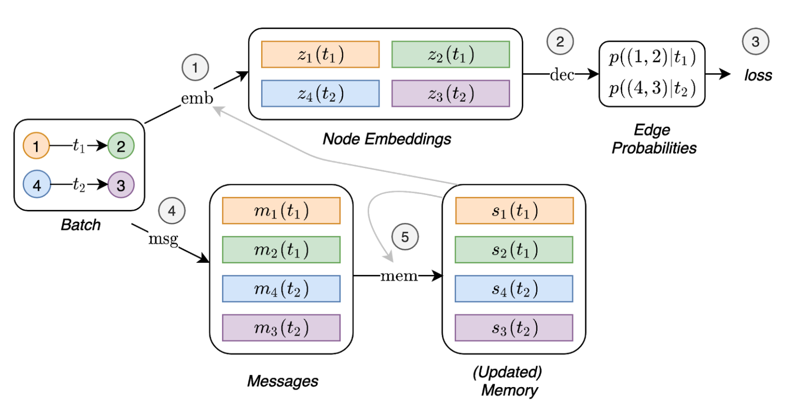

# TGN: Temporal Graph Networks

Dynamic Graph             |  TGN	
:-------------------------:|:-------------------------:	
  |  	


## Introduction

Despite the plethora of different models for deep learning on graphs, few approaches have been proposed thus far for dealing with graphs that present some sort of dynamic nature (e.g. evolving features or connectivity over time).
 
In this paper, we present Temporal Graph Networks (TGNs), a generic, efficient framework for deep learning on dynamic graphs represented as sequences of timed events. Thanks to a novel combination of memory modules and graph-based operators, TGNs are able to significantly outperform previous approaches being at the same time more computationally efficient. 

We furthermore show that several previous models for learning on dynamic graphs can be cast as specific instances of our framework. We perform a detailed ablation study of different components of our framework and devise the best configuration that achieves state-of-the-art performance on several transductive and inductive prediction tasks for dynamic graphs.


#### Paper link: [Temporal Graph Networks for Deep Learning on Dynamic Graphs](https://arxiv.org/abs/2006.10637)


## Running the experiments

### Requirements

Dependencies (with python >= 3.7):

```{bash}
pandas==1.1.0
torch==1.6.0
scikit_learn==0.23.1
```

### Dataset and Preprocessing

#### Download the public data
Download the sample datasets (eg. wikipedia and reddit) from [here](http://snap.stanford
.edu/jodie/) and store their csv files in a folder named ```data/```.

#### Preprocess the data
We use the dense `npy` format to save the features in binary format. If edge features or nodes 
features are absent, they will be replaced by a vector of zeros. 
```{bash}
python utils/preprocess_data.py --data wikipedia
python utils/preprocess_data.py --data reddit
```


### Model Training

Self-supervised learning using the link prediction task:
```{bash}
# TGN-attn: self-supervised learning on the wikipedia dataset
python train_self_supervised.py --use_memory --prefix tgn-attn --n_runs 10

# TGN-attn-reddit: self-supervised learning on the reddit dataset
python train_self_supervised.py -d reddit --use_memory --prefix tgn-attn-reddit --n_runs 10
```

### Ablation Study
Commands to replicate all results in the ablation study.

Ablation study over different models:
```{bash}
# TGN-2l
python train_self_supervised.py --use_memory --n_layer 2 --prefix tgn-2l --n_runs 10 

# TGN-no-mem
python train_self_supervised.py --prefix tgn-no-mem --n_runs 10 

# TGN-time
python train_self_supervised.py --use_memory --embedding_module time --prefix tgn-time --n_runs 10 

# TGN-id
python train_self_supervised.py --use_memory --embedding_module identity --prefix tgn-id --n_runs 10

# TGN-sum
python train_self_supervised.py --use_memory --embedding_module graph_sum --prefix tgn-sum --n_runs 10

# TGN-mean
python train_self_supervised.py --use_memory --aggregator mean --prefix tgn-mean --n_runs 10
```

Ablation study over different training strategies:
```{bash}
# TGN-id-s1
python train_self_supervised.py --use_memory --embedding_module identity --prefix TGN-id-s1 --n_runs 10 

# TGN-id-s5
python train_self_supervised.py --bs 40 --use_memory --embedding_module identity --backprop_every 5 --prefix TGN-id-s5 --n_runs 10 

# TGN-id-e1
python train_self_supervised.py --use_memory --embedding_module identity --memory_update_at_end --prefix TGN-id-e1 --n_runs 10 

# TGN-id-e5
python train_self_supervised.py --bs 40 --use_memory --embedding_module identity --backprop_every 5 --memory_update_at_end --prefix TGN-id-e5 --n_runs 10

# TGN-attn-s1
python train_self_supervised.py --use_memory --prefix TGN-attn-s1 --n_runs 10 

# TGN-attn-s5
python train_self_supervised.py --bs 40 --use_memory --backprop_every 5 --prefix TGN-attn-s5 --n_runs 10 

# TGN-attn-e1
python train_self_supervised.py --use_memory --memory_update_at_end --prefix TGN-attn-e1 --n_runs 10 

# TGN-attn-e5
python train_self_supervised.py --bs 40 --use_memory --backprop_every 5 --memory_update_at_end --prefix TGN-attn-e5 --n_runs 10

```


#### General flags

```{txt}
optional arguments:
  -d DATA, --data DATA         Data sources to use (wikipedia or reddit)
  --bs BS                      Batch size
  --prefix PREFIX              Prefix to name checkpoints and results
  --n_degree N_DEGREE          Number of neighbors to sample at each layer
  --n_head N_HEAD              Number of heads used in the attention layer
  --n_epoch N_EPOCH            Number of epochs
  --n_layer N_LAYER            Number of graph attention layers
  --lr LR                      Learning rate
  --patience                   Patience of the early stopping strategy
  --n_runs                     Number of runs (compute mean and std of results)
  --drop_out DROP_OUT          Dropout probability
  --gpu GPU                    Idx for the gpu to use
  --node_dim NODE_DIM          Dimensions of the node embedding
  --time_dim TIME_DIM          Dimensions of the time embedding
  --use_memory                 Whether to use a memory for the nodes
  --embedding_module           Type of the embedding module
  --message_function           Type of the message function
  --aggregator                 Type of the message aggregator
  --memory_update_at_the_end   Whether to update the memory at the end or at the start of the batch
  --message_dim                Dimension of the messages
  --memory_dim                 Dimension of the memory
  --backprop_every             Number of batches to process before performing backpropagation
  --different_new_nodes        Whether to use different unseen nodes for validation and testing
  --uniform                    Whether to sample the temporal neighbors uniformly (or instead take the most recent ones)
```

## TODOs 
* Add code for training on the downstream node-classification task
* Make code memory efficient: for the sake of simplicity, the memory module of the TGN model is 
implemented as a parameter (so that it is stored and loaded together of the model). However, this 
does not need to be the case, and 
more efficient implementations which treat the models as just tensors (in the same way as the 
input features) would be more amenable to large graphs.

## Cite us

```
@inproceedings{tgn_icml_grl2020,
title={Temporal Graph Networks for Deep Learning on Dynamic Graphs},
author={Emanuele Rossi and Ben Chamberlain and Fabrizio Frasca and Davide Eynard and Federico 
Monti and Michael Bronstein},
booktitle={ICML 2020 Workshop on Graph Representation Learning},
year={2020}
}
```


